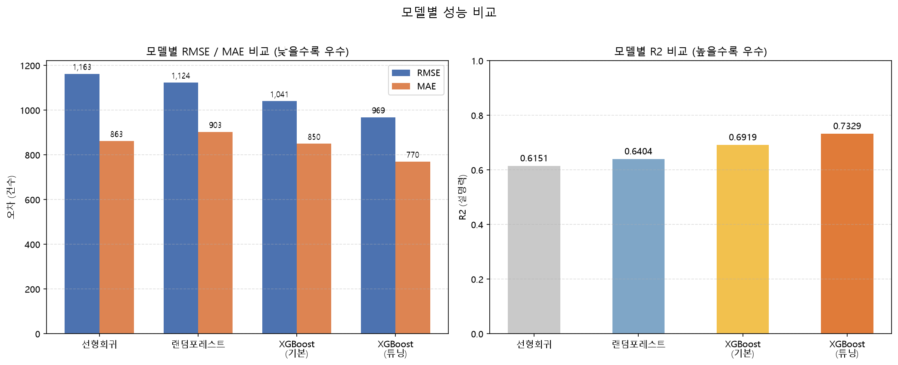
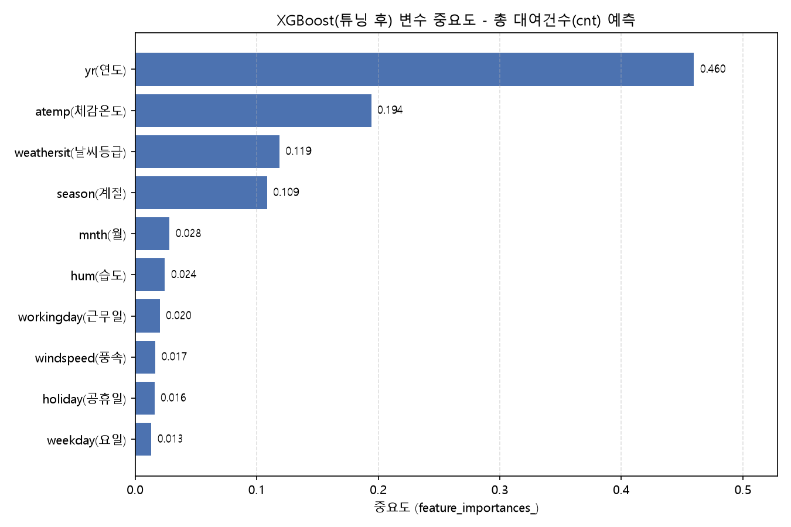
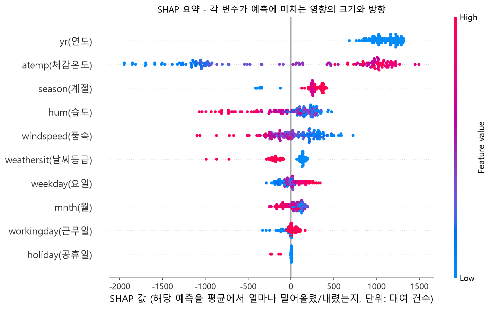
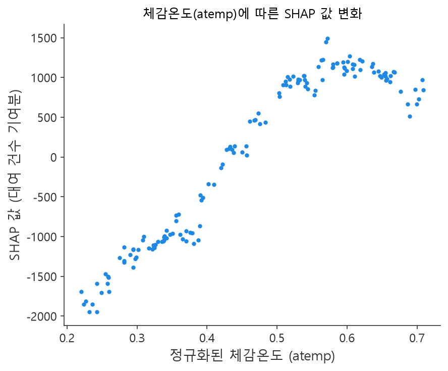

# Capital Bikeshare 대여 수요 요인 분석

Capital Bikeshare(미국 워싱턴 D.C. 일대) 일별 자전거 대여 데이터를 사용해, **"어떤 요인이 자전거 대여 수요에 영향을 주는가"**를 데이터 확인부터 모델링, 모델 재사용성 검증까지 다룬 프로젝트다.

전체 분석 과정은 CLI 기반 AI 코딩 에이전트 **Claude Code**를 활용해 진행했다. 단순히 "AI가 분석해줬다"가 아니라, 데이터 확인 -> 정제 -> 탐색적 분석 -> 시각화 -> 모델링 -> 결과 검증 -> 보정 -> 문서화로 이어지는 실제 분석 워크플로우를 Claude Code CLI로 수행한 사례다. 이 과정 자체를 [docs/CLAUDE_WORKFLOW.md](docs/CLAUDE_WORKFLOW.md)에 별도로 정리했다.

## 핵심 결과 요약

- 데이터: 731일(2011-01-01~2012-12-31), 16개 컬럼, 결측치 0건
- **시간순 분할**로 평가 — 앞 80%(2011-01-01~2012-08-06) 학습, 뒤 20%(2012-08-07~2012-12-31) 예측
- 모델 비교 결과, **튜닝된 XGBoost가 RMSE 968.75 / R2 0.7329로 최우수** (같은 기간 평균 예측 baseline RMSE 2,561 대비 62% 개선)
- 초기 회귀분석에서 **데이터 누수(casual+registered=cnt)**를 발견해 제거
- 최우수 모델에서 `yr`(연도)의 중요도가 46%로 가장 높았으나, 이는 **미래 연도로 일반화 불가능한 정보**임을 확인 → 연도별 상대지수로 detrend해 **재사용 가능한 요인(체감온도·계절·날씨등급, 합산 78%)**을 별도로 도출
- `temp`~`atemp` 상관이 0.9917로 중복이라 중요도 순위가 불안정했던 문제를 확인하고 `temp`를 제외, **SHAP으로 영향의 방향과 비선형 형태까지** 분석
- 상세 내용은 [docs/REPORT.md](docs/REPORT.md) 참고

| 순위 | 모델 | RMSE | MAE | R2 |
|---|---|---|---|---|
| 1 | **XGBoost (튜닝 후)** | **968.75** | **770.37** | **0.7329** |
| 2 | XGBoost (기본값) | 1,040.61 | 850.31 | 0.6919 |
| 3 | 랜덤포레스트 | 1,124.18 | 903.22 | 0.6404 |
| 4 | 선형회귀 | 1,163.07 | 862.73 | 0.6151 |

## 이 프로젝트에서 가장 중요한 부분: 자기 검증과 수정

**초기 버전의 R2는 0.90이었다. 지금은 0.73이다. 점수가 내려간 것이 이 프로젝트의 성과다.**

모델을 한 번 돌려 좋은 숫자를 얻는 것보다, 그 숫자가 어떻게 만들어졌는지 되짚어 **믿을 수 있는 숫자로 바꾸는 과정**에 무게를 뒀다. 분석을 마친 뒤 스스로 코드 리뷰를 수행해 다음 문제들을 찾아내고 모두 수정했다.

| 발견한 문제 | 실제 영향 | 조치 |
|---|---|---|
| **데이터 누수** — `cnt = casual + registered` | R2가 정확히 1.0000 (예측이 아닌 항등식) | 두 변수를 입력에서 제외 |
| **무작위 분할** — 시계열인데 날짜를 섞음 | 오차를 **32% 낮게** 보고 (969건 → 662건) | 시간순 분할로 교체 |
| **`yr` 외삽 불가** — 2개 범주뿐인 변수 | 연도 간 예측 시 **R2 -0.53** (평균 예측보다 나쁨) | detrend 상대지수 모델로 분리 |
| **CV의 KFold 편향** — 튜닝 단계에 같은 결함 재발 | CV가 실제보다 **364건 후한** 점수 부여 | `TimeSeriesSplit`으로 교체 |
| **다중공선성** — `temp`~`atemp` 상관 0.9917 | 모델에 따라 중요도 **순위가 역전**됨 | `temp` 제외 + SHAP 도입 |
| **문서-코드 불일치** | 실제로 없는 실험이 문서에 서술됨 | 해당 서술 삭제 |

각 문제는 지적에 그치지 않고 **수치로 검증했다.** 예를 들어 분할 방식의 영향은 `src/11_split_comparison.py`로, CV 방식의 영향은 튜닝 결과에 두 방식을 나란히 기록해 확인할 수 있다. 남은 한계는 [REPORT 8절](docs/REPORT.md)에 숨기지 않고 명시했다.

### 평가 방식에 대하여

이 데이터는 일별 시계열이므로 **날짜를 무작위로 섞어 분할하지 않았다.** 무작위로 나누면 테스트 날짜의 바로 앞뒤 날이 학습셋에 포함되는데, 대여량과 날씨는 하루 사이에 거의 변하지 않으므로 모델이 "기온·계절로 수요를 추론"하는 대신 "양옆 값을 보고 가운데를 메우는" 쉬운 문제를 풀게 된다.

분할 방식만 바꿔 실제로 측정한 결과(`src/11_split_comparison.py`):

| 분할 방식 | RMSE | R2 |
|---|---|---|
| 무작위 분할 | 662.31 | 0.8906 |
| **시간순 분할 (채택)** | **968.75** | **0.7329** |
| 2011년 학습 → 2012년 예측 | 2,206.05 | -0.5253 |

무작위 분할은 실제 오차(969건)를 662건으로 **32% 낮게** 보고한다. 세 번째 행의 음수 R2는 `yr` 변수가 미래 연도로 외삽되지 않는다는 것을 보여주며, 이것이 아래 detrend 분석의 출발점이다.

같은 이유로 **하이퍼파라미터 튜닝의 교차검증도 `TimeSeriesSplit`을 사용했다.** 기본 `KFold`로 채점하면 동일 설정에 대해 RMSE 605가 나오는데, 실제 test는 969다. 이 후한 점수를 기준으로 조합을 고르면 선택 자체가 달라진다(실제로 `max_depth` 4→3, `learning_rate` 0.05→0.1로 바뀜).

(수치는 `pip install -r requirements.txt` 후 `src/` 스크립트를 순서대로 실행하면 그대로 재현된다. 라이브러리 버전에 따라 XGBoost 계열은 소수점 단위로 값이 달라질 수 있으나 모델 순위와 결론은 동일하다.)




### 요인의 크기뿐 아니라 방향과 형태까지

gain 중요도는 "얼마나 중요한가"만 알려주므로, SHAP으로 "값이 커지면 수요가 늘어나는가, 어느 구간에서 꺾이는가"까지 분석했다(`src/12_shap_analysis.py`).



체감온도·계절은 양(+), 습도·풍속·악천후는 음(-) 방향으로 작용한다. 또한 두 지표의 순위가 최대 3계단까지 달랐는데, 특히 `weathersit`은 gain에서 3위지만 SHAP 기준으로는 6위다.



기온 효과는 선형이 아니다. 체감온도가 오를수록 수요가 급격히 늘지만 **0.5~0.6 구간에서 정점을 찍고 그 위로는 더 늘지 않는다.** 선형회귀가 이 데이터에서 성능이 낮았던 이유가 이 곡선으로 설명된다.

## 이상치 탐색 (Isolation Forest)

모델링과 별개로, 기상·수요 변수를 함께 놓고 봤을 때 어떤 날이 통계적으로 이례적인지 **Isolation Forest**로 탐색했다. 사용 변수는 `temp`, `atemp`, `hum`, `windspeed`, `weathersit`, `cnt` 6개이며, 오염도(contamination)는 5%로 설정했다. 731일 중 **37일(5.06%)**이 이상치로 탐지됐다.

이상치 각각에 대해 어떤 변수가 가장 직접적인 원인인지 z-score(표준편차 기준 이탈 정도)로 분해한 결과, `hum`(습도) 14건(38%) > `windspeed`(풍속) 11건(30%) > `atemp`(체감온도) 9건(24%) > `cnt`(대여수) 3건(8%) 순으로 나타났다. `weathersit`(날씨등급)은 37건 중 21건(57%)에서 궂은 날씨(등급3)로 동반됐지만, 범주형(4단계)이라 통계적 원인이라기보다는 습도·풍속이 튈 때 함께 기록되는 결과 라벨에 가까웠다.

가장 이상 정도가 강한 상위 5일은 외부 기상 기록과 대조해 실제 사건 여부를 확인했다.

| 날짜 | 특히 이상한 지점 | 실제 확인된 사건 |
|---|---|---|
| 2011-03-10 | 습도(hum) = 0.000 (물리적으로 비현실적) | 인근 버지니아주에서 토네이도 발생일. 토네이도는 통상 고습도 환경에서 발생하므로, 이 값은 실제 기상보다 **센서/기록 오류**로 판단됨 |
| 2011-10-29 | 고습도(96%tile)+강풍(96%tile)+궂은날씨 삼중 겹침 | 2011 핼러윈 노이스터("Snowtober") — 이례적 조기 폭설로 300만 가구 정전 |
| 2011-01-26 | 저온+고습도+강풍 동시 극단 | 2011년 1월 대설("Commutageddon") — 시간당 3인치 폭설, 65만 가구 정전 |
| **2012-10-29** | 대여수(cnt) = **22건** (전체 최저) | **허리케인 샌디 상륙일** — 메트로 전면 운행 중단, 연방정부 휴무, 비상사태 선포 |
| 2012-12-26 | 저온+고습도+강풍, 대여수 하위 0.3% | 해당 날짜 기준 역대 최다 강수량(1.42인치) 기록일 |

5건 중 4건이 실제 기록된 극단 기상 이벤트와 정확히 대응돼, Isolation Forest가 잡아낸 이상치가 노이즈가 아니라 진짜 이벤트임을 외부 검증으로 확인했다. 유일한 예외인 2011-03-10은 실제 기상(토네이도 발생 = 고습도 환경)과 기록값(습도 0)이 모순되어 데이터 오류 가능성이 더 높은 케이스다.

이 탐색은 원본 데이터나 기존 파이프라인(`src/01~12`)을 수정하지 않은 별도 분석이며, 결과는 `outputs/anomaly/`에 저장했다.

```
outputs/anomaly/
├── anomaly_causes.html        이상치 원인 변수 시각화 (막대그래프 + 습도×풍속 산점도)
├── isoforest_anomalies.csv    이상치 37건 전체 원본 데이터
└── isoforest_root_cause.csv   37건별 1·2순위 원인 변수 및 z-score
```

## 휴일이 대여량에 미치는 영향

`holiday` 변수가 수요에 유의미한 영향을 주는지 확인했다. 요일 효과를 통제하기 위해 평일(월~금)만 비교했다.

| 구분 | 휴일 평일 (n=21) | 일반 평일 (n=500) | 변화 |
|---|---|---|---|
| casual (비회원/여가) | 1,065건 | 607건 | **+75%** |
| registered (회원/통근) | 2,670건 | 3,978건 | **-33%** |
| 합계 cnt | 3,735건 | 4,585건 | -18% (Welch t-test p=0.08, 유의수준 미달) |

전체 대여량(cnt) 차이는 통계적으로 유의하지 않다(p=0.08). 하지만 **casual과 registered로 나누면 방향이 정반대**로 뚜렷하게 갈린다 — 휴일엔 통근 목적의 회원 이용이 크게 줄고, 여가 목적의 비회원 이용이 크게 늘어 서로 상쇄된다. 즉 휴일은 "대여량을 줄이는 요인"이 아니라 **"이용자 구성을 통근형에서 여가형으로 바꾸는 요인"**으로 해석하는 것이 더 정확하다.

## 최우수 모델의 예측 오차 분석

튜닝된 XGBoost(RMSE 968.75)로 731일 전체를 예측하고, 실제값과의 차이가 가장 큰 10일을 뽑았다(`outputs/prediction/top10_residuals.csv`). 10일 모두 test 구간(2012-08-07~2012-12-31)에서 나왔다 — train 구간은 모델이 학습한 데이터라 예측이 사실상 완벽하기 때문이다.

| 날짜 | 실제 | 예측 | 차이(실제-예측) |
|---|---|---|---|
| 2012-08-19 | 4,549 | 7,331 | -2,782 |
| 2012-11-22 | 2,425 | 5,158 | -2,733 |
| 2012-08-17 | 7,148 | 4,447 | +2,701 |
| 2012-10-29 | 22 | 2,622 | -2,600 |
| 2012-10-30 | 1,096 | 3,189 | -2,093 |
| 2012-10-07 | 3,510 | 5,566 | -2,056 |
| 2012-12-08 | 5,582 | 3,544 | +2,038 |
| 2012-10-08 | 5,478 | 3,574 | +1,904 |
| 2012-12-24 | 920 | 2,662 | -1,742 |
| 2012-09-09 | 8,227 | 6,538 | +1,689 |

이 10일을 앞서 찾은 이상치 37일과 대조하면 **겹치는 날은 2012-10-29(허리케인 샌디) 단 1일뿐**이다. 이 결과는 "이상 기상 = 예측 실패"가 아님을 보여준다.

- **이상치 37일 중 34일은 train 구간**에 속해 애초에 오차 비교 대상이 아니고, test 구간에 속한 나머지 3일(2012-10-29, 2012-12-26, 2012-10-02) 중에서도 실제로 예측이 크게 틀린 건 2012-10-29 하나뿐이다. 즉 궂은 날씨-수요 감소 관계 자체는 모델이 꽤 견고하게 일반화했다.
- 반대로 오차 상위 9일(2012-11-22 추수감사절 등)은 기상 변수로는 평범한 날인데도 크게 틀렸다 — 날씨가 아니라 **데이터에 없는 캘린더/이벤트 정보**가 원인이다.
- 유일한 교집합인 2012-10-29는 입력값도 이상하고 예측도 완전히 틀린, 학습 기간에 유사 사례가 없던 **진짜 극단 이벤트**다.

**결론**: 이상치 탐지와 예측 오차는 서로 다른 것을 측정한다 — 하나는 "입력값이 낯선가", 하나는 "모델이 배운 패턴으로 설명되는가"다. 두 리스트가 거의 안 겹친다는 사실은 모델 성능이 부족하다는 신호가 아니라, **모델이 날씨-수요 관계는 잘 일반화했고 남은 오차는 날씨로 설명 안 되는 이벤트성 요인 때문**이라는 근거다. `yr`(연도) 변수의 외삽 불가 문제와 마찬가지로, 이 역시 "모델의 한계"보다는 **"입력 데이터에 없는 정보의 한계"**로 봐야 한다.

## 프로젝트 구조

```
capital-bikeshare-portfolio/
├── README.md                  이 파일
├── requirements.txt            의존성 목록
├── data/
│   └── day.csv                 원본 데이터 (train/test는 03번 스크립트 실행 시 생성됨)
├── src/                        분석 파이프라인 (숫자 순서대로 실행)
│   ├── 01_data_quality_check.py
│   ├── 02_eda_visualizations.py
│   ├── 03_train_test_split.py
│   ├── 04_linear_regression.py
│   ├── 05_random_forest.py
│   ├── 06_xgboost_baseline.py
│   ├── 07_xgboost_tuning.py
│   ├── 08_model_comparison.py
│   ├── 09_feature_importance.py
│   ├── 10_detrend_analysis.py
│   ├── 11_split_comparison.py   분할 방식이 평가에 미치는 영향 비교
│   ├── 12_shap_analysis.py      SHAP: 영향의 방향·비선형 형태 분석
│   └── common.py                공통 설정 (입력 변수 목록, 튜닝 파라미터)
├── outputs/
│   ├── quality/                 데이터 품질 점검 결과
│   ├── eda/                     탐색적 분석 시각화
│   └── model/                   모델 성능·중요도 결과
└── docs/
    ├── REPORT.md                상세 분석 리포트 (최종 결론 포함)
    └── CLAUDE_WORKFLOW.md       Claude Code를 활용한 분석 과정 정리
```

## 재현 방법

```bash
# 1. 의존성 설치
pip install -r requirements.txt

# 2. 프로젝트 루트(capital-bikeshare-portfolio/)에서 순서대로 실행
python src/01_data_quality_check.py
python src/02_eda_visualizations.py
python src/03_train_test_split.py     # data/train.csv, data/test.csv 생성
python src/04_linear_regression.py
python src/05_random_forest.py
python src/06_xgboost_baseline.py
python src/07_xgboost_tuning.py       # GridSearchCV, 수 분 소요
python src/08_model_comparison.py     # 04~07 결과 md를 파싱해 비교 그래프 생성
python src/09_feature_importance.py
python src/10_detrend_analysis.py
python src/11_split_comparison.py
python src/12_shap_analysis.py
```

각 스크립트는 `outputs/` 아래 자신의 결과(md/png/csv)를 저장하며, 위 순서대로 실행하면 이 README와 `docs/REPORT.md`에 기록된 수치가 그대로 재현된다.

## 데이터 출처

- [Bike Sharing Dataset (UCI Machine Learning Repository)](https://archive.ics.uci.edu/dataset/275/bike+sharing+dataset) — Capital Bikeshare 일별/시간별 대여 데이터
