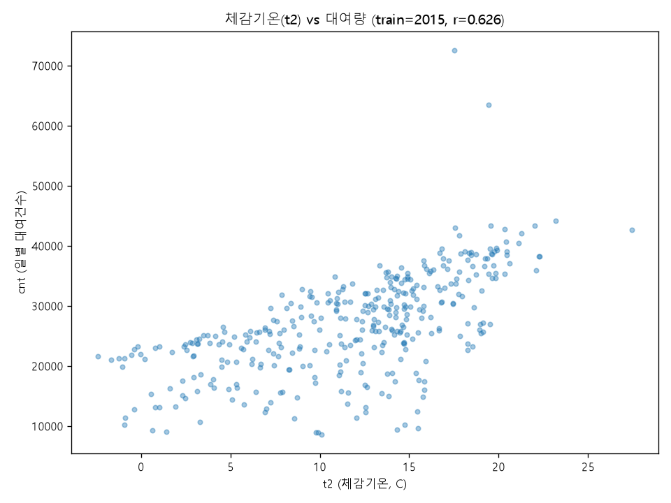
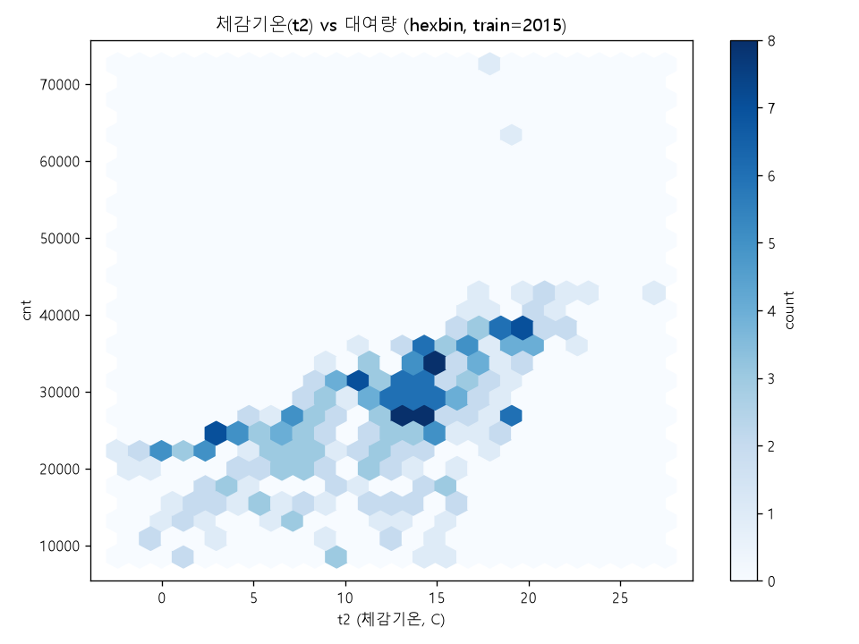
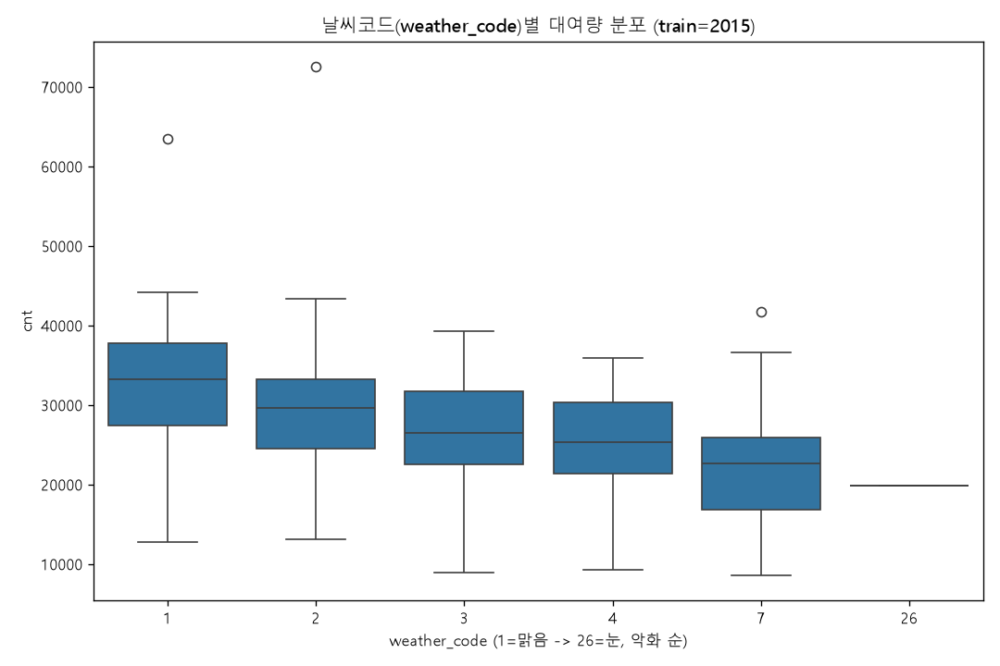
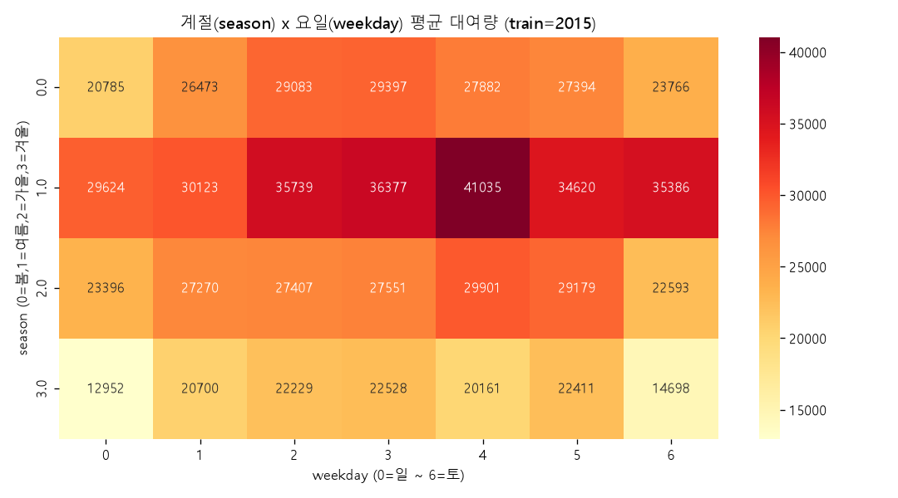
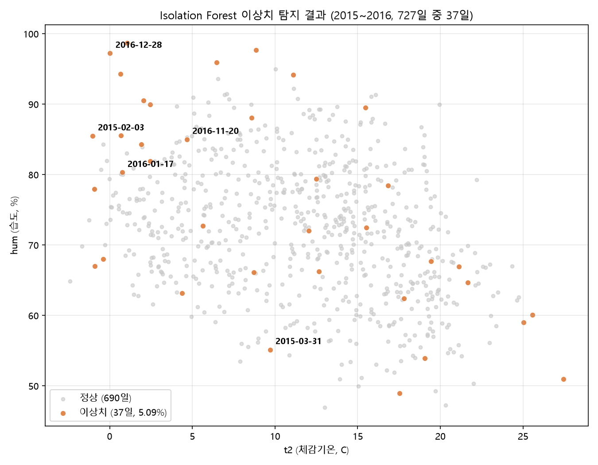
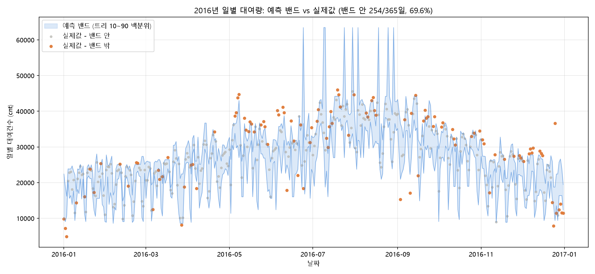

# London Bike Sharing 수요 예측 — Claude Code 데이터 분석 포트폴리오

**터미널 기반 AI 코딩 에이전트 Claude Code**를 데이터 분석 파트너로 써서, 런던 공유자전거(Santander Cycles) 시간별 원본 데이터를 일별로 직접 변환하는 단계부터 시작해 **2015년 데이터로 학습한 모델이 2016년 대여량을 얼마나 정확히 예측하는지**를 끝까지 검증한 프로젝트다.

이 README는 "AI가 대신 분석해줬다"를 보여주려는 게 아니라, **분석가가 Claude Code를 도구로 써서 가설을 세우고, 실측으로 검증하고, 틀린 가설도 숨기지 않고 기록하는 과정** 자체를 보여주려고 쓴다. 이 프로젝트 하나로 확인할 수 있는 역량은 아래 표와 같다.

| 역량 | 이 프로젝트에서 확인할 수 있는 지점 |
|---|---|
| 원본 데이터 처리부터 시작하는 능력 | 시간별 17,414행을 직접 규칙을 세워 일별 730행으로 변환(`docs/DAILY_CONVERSION_PLAN.md`) |
| 이전 프로젝트의 교훈을 다음 설계에 선반영하는 능력 | 워싱턴에서 사후에 발견한 문제 3가지를 런던은 계획 단계부터 실측 검증 후 배제 (아래 표) |
| 모델 우열을 가정하지 않고 실측으로 결정하는 태도 | 6개 모델 비교 → 예상(XGBoost)과 다른 결과(랜덤포레스트)가 나오자 그대로 채택 |
| 자기 결론을 스스로 의심하고 재검증하는 습관 | log 변환 재비교, 원-핫 인코딩 재비교 — 결과가 뒤집혀도 그대로 보고 |
| 외부 사실과 대조해 결과를 검증하는 습관 | 이상치 최상위권을 뉴스 기사와 대조해 런던 지하철 파업일임을 확인 |
| **다른 사람의 분석과 정직하게 비교하고, 차이의 원인을 실측으로 규명하는 능력** | 공개 저장소와 결과가 다르다는 걸 숨기지 않고, 원인(인코딩 방식)을 가설 → 실험 → 확인까지 끝까지 추적 (아래 "다른 분석과의 비교" 절) |
| Claude Code와의 실제 협업 과정 | 매 단계 질문·검증·수정 사이클을 `docs/CLAUDE_WORKFLOW.md`에 시간순으로 기록 |

## 핵심 결과 요약

- 원본: 시간별 데이터 17,414행(2015-01-04~2017-01-03) → 일별 변환 730행 → 2015/2016만 사용(2017년 3일치 제외)
- 최종 입력 변수 9개: `season, mnth, weekday, is_holiday, workingday, weather_code, t2(체감기온), hum(습도), wind_speed`
- 모델 비교 결과, **랜덤포레스트가 RMSE 4,308.82 / R² 0.7556로 최우수** (train 평균만 예측하는 baseline RMSE 8,757.83 대비 50.8% 개선)
- 워싱턴은 항상 튜닝된 XGBoost가 1위였지만, 런던은 랜덤포레스트가 근소 우위 — **결과를 미리 가정하지 않고 실측으로 채택**
- 변수 중요도: 체감기온(t2) 42.1% + 습도(hum) 23.3%로 두 변수가 지배적. **런던은 습도의 영향이 워싱턴보다 훨씬 강하다**(상관 -0.587 vs 워싱턴 -0.101)
- 상세 내용은 [docs/REPORT.md](docs/REPORT.md) 참고

| 순위 | 모델 | RMSE | MAE | R2 |
|---|---|---|---|---|
| 1 | **랜덤포레스트** | **4,308.82** | **3,169.69** | **0.7556** |
| 2 | Lasso | 4,351.50 | 3,381.41 | 0.7508 |
| 3 | Ridge | 4,357.40 | 3,385.77 | 0.7501 |
| 4 | 선형회귀 | 4,359.46 | 3,387.17 | 0.7499 |
| 5 | XGBoost (튜닝) | 4,419.45 | 3,148.64 | 0.7429 |
| 6 | XGBoost (기본값) | 4,931.37 | 3,477.51 | 0.6799 |

## 탐색적 데이터 분석(EDA)

| | |
|---|---|
|  |  |
|  |  |

체감기온(t2)과 대여량은 뚜렷한 양의 상관(r=0.626), 날씨코드는 1(맑음)→26(눈)으로 악화될수록 대여량이 감소하는 경향, 계절×요일 히트맵은 계절 효과가 요일 효과보다 지배적임을 보여준다(자세한 수치는 [핵심 결과 요약](#핵심-결과-요약)과 `outputs/eda/correlation_summary.md` 참고).

## 워싱턴에서 배운 교훈을 처음부터 반영한 3가지

워싱턴 프로젝트([01_washington](../01_washington))는 `yr`(연도) 변수의 외삽 불가 문제, 다중공선성, 무작위 분할의 함정을 **분석을 다 끝낸 뒤에야 발견**했다. 런던에서는 같은 실수를 반복하지 않기 위해 계획 수립 단계에서 미리 실측 검증했다.

| 문제 | 확인 방법 | 조치 |
|---|---|---|
| `yr`이 train(2015)/test(2016) 각각 단일값 | 상관계수 계산 시 NaN으로 나옴을 사전 확인 | 계획 단계부터 입력에서 제외 (워싱턴은 사후 detrend로 보정) |
| `t1`(실제기온)~`t2`(체감기온) 다중공선성 | 상관계수 0.992 실측 | `t1` 제외, `t2`만 사용 |
| `is_weekend`가 `weekday`의 완전 중복 | 730일 전체에서 weekday 0·6일 때만 is_weekend=1임을 확인, 예외 없음 | `is_weekend` 제외 |

## 다른 분석과의 비교: 결과가 다르면 숨기지 않고 원인을 끝까지 추적한다

같은 데이터·같은 "2015→2016" 설계로 분석한 다른 공개 저장소([jskim414/london-bike-demand-analysis](https://github.com/jskim414/london-bike-demand-analysis))는 **Ridge를 최우수 모델(R² 0.791)**로 보고했다 — 이 프로젝트의 랜덤포레스트(R² 0.7556)와 다른 결론이다.

결과가 다르다는 걸 숨기지 않고 비교 분석(`docs/good_templet.md`)부터 진행했다. 그쪽은 `season`/`weather_code`를 원-핫 인코딩했고, 이 프로젝트는 숫자(서수) 그대로 넣었다는 차이를 발견해 가설을 세웠고, 실제로 재현해봤다(`src/16_onehot_ridge.py`).

| 모델 | 인코딩 | RMSE | R2 |
|---|---|---|---|
| 랜덤포레스트 (이 프로젝트 최우수) | 서수 | 4,308.82 | 0.7556 |
| 선형회귀 (원-핫, 무규제) | 원-핫 | 4,247.43 | 0.7626 |
| **Ridge (원-핫)** | 원-핫 | **4,225.45** | **0.7650** |

**가설이 정확히 재현됐다.** 극희귀 범주(`weather_code=26`(눈), train 1일뿐)를 원-핫 인코딩하면 무규제 회귀의 계수가 **+2,453**까지 불안정하게 튀는데(jskim414가 보고한 +2,470과 거의 일치), Ridge 정규화로 **+460**까지 안정화되면서 결국 **원-핫 Ridge가 랜덤포레스트를 실제로 이겼다.**

즉 "최우수 모델"은 데이터 자체가 아니라 **전처리(인코딩) 설계에 종속된 결론**이라는 걸 다른 저장소를 관찰만 하는 게 아니라 **직접 재현해서 확인**했다. 이 프로젝트는 다른 기간 데이터를 추가할 때 전처리를 최소화하기 위해 원본 인코딩을 유지하기로 이미 결정했었기 때문(`docs/PREPROCESSING_NOTES.md`) 메인 결론은 랜덤포레스트로 유지하되, 이 실험 결과는 그 선택이 성능에 미치는 영향을 투명하게 남긴다. 자세한 비교 과정은 [docs/good_templet.md](docs/good_templet.md), 실험 상세는 [docs/REPORT.md](docs/REPORT.md) 4.6절 참고.

## 이상치 탐지: 날씨로 설명 안 되는 실제 사건

Isolation Forest(contamination 5%)로 2015~2016년 727일 중 37일(5.09%)을 이상치로 탐지했다. 상위권 대부분은 눈·강풍·고습도가 겹친 겨울날이었지만, **가장 눈에 띄는 발견은 2015-07-09(대여량 72,504건, 전체 최고 수준)**였다.



외부 뉴스([Cycling Weekly](https://www.cyclingweekly.com/news/latest-news/tube-strike-forces-londoners-take-bikes-305938))로 대조한 결과, 이 날은 **런던 지하철 전면파업일**로 실제 자전거 대여 서비스가 개시 이래 최다 이용일(73,094건)을 기록한 날과 정확히 일치했다. 날씨 변수만으로는 절대 설명할 수 없는 사회적 이벤트가 이상치로 정확히 잡힌 사례다 — 워싱턴에서 허리케인 샌디를 찾아낸 것과 같은 성격의 검증이다.

## 강건성 검증: 결론을 스스로 의심해봤다

최우수 모델이라는 결론이 우연이 아닌지 두 가지 방식으로 재검증했다(`docs/REPORT.md` 4.5~4.6절).

- **log(cnt) 변환**: 목표변수를 로그 변환해 6개 모델을 재비교했다. 예상(선형모델이 유리해질 것)과 반대로 XGBoost가 크게 개선되고 선형모델은 오히려 나빠졌지만, **랜덤포레스트만은 변환 여부와 무관하게 1위를 유지**했다.
- **원-핫 인코딩**: 위 "다른 분석과의 비교" 절 참고 — 이번엔 실제로 순위가 뒤집혔다.

두 실험 모두 "이겼으면 됐다"에서 멈추지 않고, 결론이 얼마나 견고한지(혹은 얼마나 조건에 의존하는지)를 스스로 확인한 결과다.

## 예측 밴드 시각화

최우수 모델(랜덤포레스트) 300개 트리의 예측 분포로 10~90 백분위(80%) 밴드를 만들어 2016년 실제값과 겹쳐 봤다. 인터랙티브 버전은 [outputs/model/prediction_band_2016.html](outputs/model/prediction_band_2016.html)(툴팁으로 날짜별 조회 가능).



- 밴드 안에 들어간 날: **254일 / 365일 (69.6%)**
- 명목 80% 구간인데 실측 커버리지가 69.6%로 낮은 이유: 이 밴드는 트리 간 예측 분산(모델 불확실성)만 반영하고, 데이터 자체의 순수 잔차(residual noise)는 포함하지 않기 때문이다. 실무 적용 시 conformal prediction 등으로 보정이 필요하다는 한계를 리포트에 명시했다.

## 프로젝트 구조

```
02_london/
├── README.md                   이 파일
├── requirements.txt
├── data/
│   ├── preprocess/              원본(london_merged.csv) + 일별 변환본(day_london.csv)
│   └── processed/                연도별 분리본(day_london_2015.csv, day_london_2016.csv)
├── src/                         분석 파이프라인 (숫자 순서대로 실행)
│   ├── 01_hourly_to_daily.py     시간별 -> 일별 변환
│   ├── 02_split_by_year.py       연도별 분리
│   ├── 03_data_quality_check.py
│   ├── 04_eda_visualizations.py
│   ├── 05_linear_regression.py
│   ├── 06_random_forest.py
│   ├── 07_xgboost_baseline.py
│   ├── 08_ridge_lasso.py         Ridge/Lasso (정규화 선형회귀)
│   ├── 09_xgboost_tuning.py
│   ├── 10_model_comparison.py
│   ├── 11_feature_importance.py
│   ├── 12_shap_analysis.py
│   ├── 13_anomaly_detection.py
│   ├── 14_prediction_band.py     예측 밴드 vs 실제값 데이터 생성
│   ├── 15_log_target_comparison.py   강건성 검증: log(cnt) 변환 재비교
│   ├── 16_onehot_ridge.py            강건성 검증: 원-핫 인코딩 + Ridge 재실험
│   ├── 17_anomaly_visualization.py   이상치 탐지 결과 정적 시각화(README 임베드용)
│   ├── 18_prediction_band_static.py  예측 밴드 정적 시각화(README 임베드용)
│   └── common.py                 공통 설정 (입력 변수 목록, 최적 하이퍼파라미터)
├── outputs/
│   ├── quality/, eda/, model/, anomaly/
└── docs/
    ├── REPORT.md                  상세 분석 리포트 (최종 결론 포함)
    ├── CLAUDE_WORKFLOW.md         Claude Code 협업 과정 기록
    ├── ANALYSIS_PLAN.md           통합 분석 계획서 (실행 전 수립)
    ├── DAILY_CONVERSION_PLAN.md   시간별->일별 변환 계획·실행 결과
    ├── PREPROCESSING_NOTES.md     컬럼별 집계 규칙 확정 근거
    └── good_templet.md            외부 공개 저장소와의 비교 분석
```

## 재현 방법

```bash
pip install -r requirements.txt

# data/preprocess/london_merged.csv(원본 시간별 데이터)가 있는 상태에서 순서대로 실행
python src/01_hourly_to_daily.py     # data/preprocess/day_london.csv 생성
python src/02_split_by_year.py       # data/processed/day_london_2015.csv, 2016.csv 생성
python src/03_data_quality_check.py
python src/04_eda_visualizations.py
python src/05_linear_regression.py
python src/06_random_forest.py
python src/07_xgboost_baseline.py
python src/08_ridge_lasso.py
python src/09_xgboost_tuning.py      # GridSearchCV, 수 분 소요
python src/10_model_comparison.py    # 08, 09 결과를 함께 파싱하므로 반드시 그 뒤에 실행
python src/11_feature_importance.py
python src/12_shap_analysis.py
python src/13_anomaly_detection.py
python src/14_prediction_band.py
python src/15_log_target_comparison.py   # 강건성 검증(선택)
python src/16_onehot_ridge.py            # 강건성 검증(선택)
python src/17_anomaly_visualization.py   # README용 정적 이미지
python src/18_prediction_band_static.py  # README용 정적 이미지
```

## 데이터 출처

- [London bike sharing dataset (Kaggle, hmavrodiev)](https://www.kaggle.com/datasets/hmavrodiev/london-bike-sharing-dataset)
