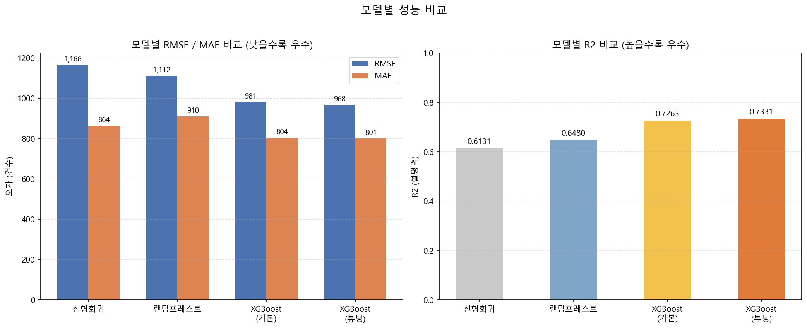
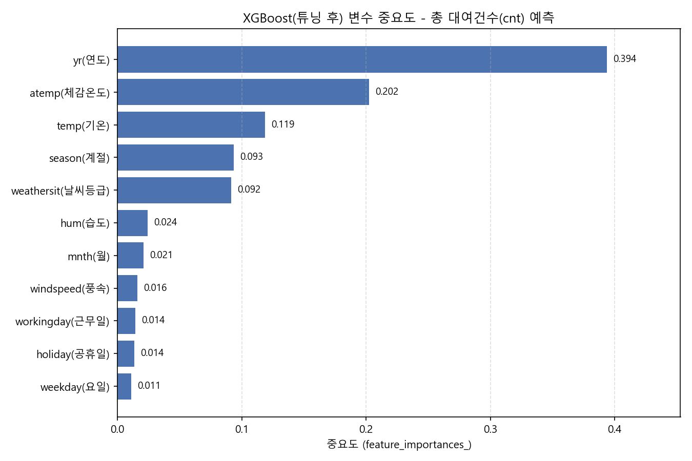

# Capital Bikeshare 대여 수요 요인 분석

Capital Bikeshare(미국 워싱턴 D.C. 일대) 일별 자전거 대여 데이터를 사용해, **"어떤 요인이 자전거 대여 수요에 영향을 주는가"**를 데이터 확인부터 모델링, 모델 재사용성 검증까지 다룬 프로젝트다.

전체 분석 과정은 CLI 기반 AI 코딩 에이전트 **Claude Code**를 활용해 진행했다. 단순히 "AI가 분석해줬다"가 아니라, 데이터 확인 -> 정제 -> 탐색적 분석 -> 시각화 -> 모델링 -> 결과 검증 -> 보정 -> 문서화로 이어지는 실제 분석 워크플로우를 Claude Code CLI로 수행한 사례다. 이 과정 자체를 [docs/CLAUDE_WORKFLOW.md](docs/CLAUDE_WORKFLOW.md)에 별도로 정리했다.

## 핵심 결과 요약

- 데이터: 731일(2011-01-01~2012-12-31), 16개 컬럼, 결측치 0건
- **시간순 분할**로 평가 — 앞 80%(2011-01-01~2012-08-06) 학습, 뒤 20%(2012-08-07~2012-12-31) 예측
- 모델 비교 결과, **튜닝된 XGBoost가 RMSE 968.39 / R2 0.7331로 최우수** (같은 기간 평균 예측 baseline RMSE 2,561 대비 62% 개선)
- 초기 회귀분석에서 **데이터 누수(casual+registered=cnt)**를 발견해 제거
- 최우수 모델에서 `yr`(연도)의 중요도가 39%로 가장 높았으나, 이는 **미래 연도로 일반화 불가능한 정보**임을 확인 → 연도별 상대지수로 detrend해 **재사용 가능한 요인(계절·기온·날씨등급, 합산 83%)**을 별도로 도출
- 상세 내용은 [docs/REPORT.md](docs/REPORT.md) 참고

| 순위 | 모델 | RMSE | MAE | R2 |
|---|---|---|---|---|
| 1 | **XGBoost (튜닝 후)** | **968.39** | **801.40** | **0.7331** |
| 2 | XGBoost (기본값) | 980.80 | 804.28 | 0.7263 |
| 3 | 랜덤포레스트 | 1,112.20 | 910.29 | 0.6480 |
| 4 | 선형회귀 | 1,166.02 | 863.86 | 0.6131 |

### 평가 방식에 대하여

이 데이터는 일별 시계열이므로 **날짜를 무작위로 섞어 분할하지 않았다.** 무작위로 나누면 테스트 날짜의 바로 앞뒤 날이 학습셋에 포함되는데, 대여량과 날씨는 하루 사이에 거의 변하지 않으므로 모델이 "기온·계절로 수요를 추론"하는 대신 "양옆 값을 보고 가운데를 메우는" 쉬운 문제를 풀게 된다.

분할 방식만 바꿔 실제로 측정한 결과(`src/11_split_comparison.py`):

| 분할 방식 | RMSE | R2 |
|---|---|---|
| 무작위 분할 | 655.15 | 0.8930 |
| **시간순 분할 (채택)** | **968.39** | **0.7331** |
| 2011년 학습 → 2012년 예측 | 2,211.75 | -0.5332 |

무작위 분할은 실제 오차(968건)를 655건으로 **32% 낮게** 보고한다. 세 번째 행의 음수 R2는 `yr` 변수가 미래 연도로 외삽되지 않는다는 것을 보여주며, 이것이 아래 detrend 분석의 출발점이다.

같은 이유로 **하이퍼파라미터 튜닝의 교차검증도 `TimeSeriesSplit`을 사용했다.** 기본 `KFold`로 채점하면 동일 설정에 대해 RMSE 597이 나오는데, 실제 test는 968이다. 이 후한 점수를 기준으로 조합을 고르면 선택 자체가 달라진다(실제로 `max_depth` 4→3, `learning_rate` 0.05→0.1로 바뀜).

(수치는 `pip install -r requirements.txt` 후 `src/` 스크립트를 순서대로 실행하면 그대로 재현된다. 라이브러리 버전에 따라 XGBoost 계열은 소수점 단위로 값이 달라질 수 있으나 모델 순위와 결론은 동일하다.)




## 프로젝트 구조

```
capital-bikeshare-portfolio/
├── README.md                  이 파일
├── requirements.txt            의존성 목록
├── data/
│   └── day.csv                 원본 데이터 (train/test는 03번 스크립트 실행 시 생성됨)
├── src/                        분석 파이프라인 (숫자 순서대로 실행)
│   ├── 01_data_quality_check.py
│   ├── 02_eda_visualizations.py
│   ├── 03_train_test_split.py
│   ├── 04_linear_regression.py
│   ├── 05_random_forest.py
│   ├── 06_xgboost_baseline.py
│   ├── 07_xgboost_tuning.py
│   ├── 08_model_comparison.py
│   ├── 09_feature_importance.py
│   ├── 10_detrend_analysis.py
│   ├── 11_split_comparison.py   분할 방식이 평가에 미치는 영향 비교
│   └── common.py                공통 유틸 (튜닝 결과 파라미터 로드)
├── outputs/
│   ├── quality/                 데이터 품질 점검 결과
│   ├── eda/                     탐색적 분석 시각화
│   └── model/                   모델 성능·중요도 결과
└── docs/
    ├── REPORT.md                상세 분석 리포트 (최종 결론 포함)
    └── CLAUDE_WORKFLOW.md       Claude Code를 활용한 분석 과정 정리
```

## 재현 방법

```bash
# 1. 의존성 설치
pip install -r requirements.txt

# 2. 프로젝트 루트(capital-bikeshare-portfolio/)에서 순서대로 실행
python src/01_data_quality_check.py
python src/02_eda_visualizations.py
python src/03_train_test_split.py     # data/train.csv, data/test.csv 생성
python src/04_linear_regression.py
python src/05_random_forest.py
python src/06_xgboost_baseline.py
python src/07_xgboost_tuning.py       # GridSearchCV, 수 분 소요
python src/08_model_comparison.py     # 04~07 결과 md를 파싱해 비교 그래프 생성
python src/09_feature_importance.py
python src/10_detrend_analysis.py
python src/11_split_comparison.py
```

각 스크립트는 `outputs/` 아래 자신의 결과(md/png/csv)를 저장하며, 위 순서대로 실행하면 이 README와 `docs/REPORT.md`에 기록된 수치가 그대로 재현된다.

## 데이터 출처

- [Bike Sharing Dataset (UCI Machine Learning Repository)](https://archive.ics.uci.edu/dataset/275/bike+sharing+dataset) — Capital Bikeshare 일별/시간별 대여 데이터
